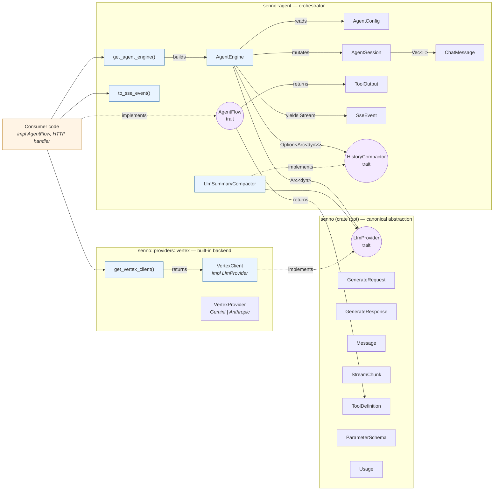

# Architecture

Three modules, layered bottom-up:

1. **`senno` (crate root)** — canonical types + the `LlmProvider`, `EmbeddingProvider`, `BatchGenerationProvider`, and `BatchEmbeddingProvider` traits, plus the `one_shot` helper. No I/O.
2. **`senno::providers::vertex`** (feature `vertex`) — one `LlmProvider` implementation (Gemini + Anthropic via Vertex), plus Gemini text embeddings and Batch API bulk generation and bulk embedding.
3. **`senno::agent`** — orchestration loop (engine, session, tool calling, SSE). Depends only on the crate-root types.

Consumers plug in their own `AgentFlow` (domain logic) and wire the engine into an HTTP handler.

## Map

Hover any node for a one-line explanation (GitHub, VS Code, and mermaid.live all render the tooltips).

### Legend

- **Oval nodes (`(( ))`)** — traits. Interface boundaries consumers can plug into.
- **Purple-tinted** — trait definitions.
- **Blue-tinted** — concrete built-in code (types, factories, helpers).
- **Orange-tinted** — consumer code (out of this crate).

## Why these three modules

**Why the LLM core is separate from `agent`**: the canonical types are valuable on their own. A consumer who just needs "call an LLM" can use the crate root (`one_shot`) + `senno::providers::vertex` without touching the agent machinery. The agent module then layers on top without being tangled with backend concerns.

**Why `vertex` lives in `providers`**: it's a specific backend provider. Future backends (OpenAI, Bedrock, Ollama) belong in their own modules alongside it — each behind its own feature flag, each implementing `LlmProvider`.

**Why the engine doesn't own a `VertexClient`**: it owns `Arc<dyn LlmProvider>`. Swapping backends costs one line at the call site; zero lines inside `senno::agent`.

## Next

- [sequence.md](sequence.md) — what a request actually looks like at runtime.
- [extending.md](extending.md) — how to write your own `AgentFlow`, swap the LLM backend, or replace the history compactor.
