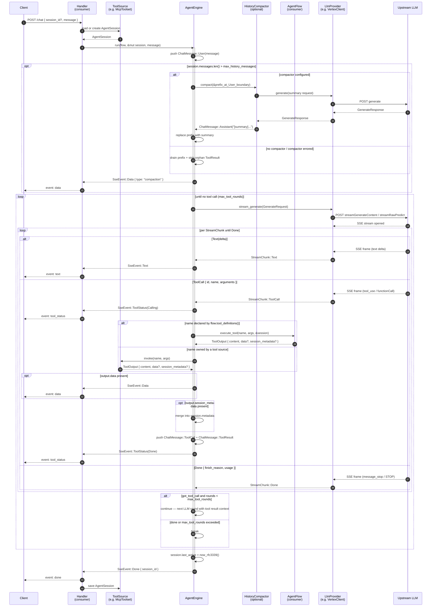

# Request Sequence

A single chat request end-to-end. See [architecture.md](architecture.md) for the static picture of who-talks-to-whom.

## Error paths

Not drawn in the diagram so the happy path stays readable. All paths still terminate with `SseEvent::Done`, so the handler always sees a clean end-of-stream.

| Failure                                   | Engine emits                                                                 | Loop behaviour                                                                                                                                        |
| ----------------------------------------- | ---------------------------------------------------------------------------- | ----------------------------------------------------------------------------------------------------------------------------------------------------- |
| `provider.stream_generate()` returns Err  | `SseEvent::Error { code: "llm_error", .. }`                                  | outer loop breaks                                                                                                                                     |
| Mid-stream chunk is Err                   | `SseEvent::Error { code: "stream_error", .. }`                               | inner chunk loop breaks; outer continues if a tool call was already handled this round                                                                |
| `source.invoke()` returns Err             | same as below — a tool source is dispatched through the identical path       |
| `flow.execute_tool()` returns Err         | `SseEvent::ToolStatus(Error)` + `SseEvent::Error { code: "tool_error", .. }` | the error's `Display` text is fed back to the LLM as the tool's content (`Error executing <name>: <detail>`) so the model can recover; loop continues |
| `HistoryCompactor::compact()` returns Err | `SseEvent::Data { type: "compaction", .. }` with `strategy: "truncate"`      | logged at `warn!`; falls through to raw truncation                                                                                                    |
| `max_tool_rounds` reached                 | `SseEvent::Error { code: "max_tool_rounds", .. }`                            | outer loop breaks                                                                                                                                     |

Every `Error` frame's `message` is a fixed sentence built in `types.rs` (`SseEvent::llm_error()`, `stream_error()`, `tool_error(tool)`, `max_tool_rounds()`). The failing `Error` itself goes to `tracing` and is never serialized to the client; `SseEvent::from_result` does the same for an `Err` item (`code: "internal"`).

## What the client sees over the wire

Each `SseEvent` variant maps to a distinct SSE event type (via `to_sse_event`, feature `axum`):

| `SseEvent` variant                   | SSE `event:`  | `data:` payload                                                                |
| ------------------------------------ | ------------- | ------------------------------------------------------------------------------ |
| `Text { delta }`                     | `text`        | raw string                                                                     |
| `ToolStatus { tool, status, label }` | `tool_status` | `{"tool": "<name>", "status": "calling"\|"done"\|"error", "label": "<text>"?}` |
| `Data { type, payload }`             | `data`        | `{"type": "<type>", "payload": <json>}`                                        |
| `Error { code, message }`            | `error`       | `{"code": "<code>", "message": "<text>"}`                                      |
| `Done { session_id }`                | `done`        | `{"session_id": "<id>"}`                                                       |

`label` is populated from the tool call's `doing` argument when the model supplies one, and omitted from the payload otherwise.

`message` is always one of the fixed sentences above — never provider, model or tool text. Token accounting lives on `AgentSession.usage` and is not a frame.

## Session mutations during a run

The engine mutates `session` in place. After the stream completes, the consumer persists it. In order:

1. **User message** pushed at the start.
2. **History compaction** (optional) — replaces a prefix with a single `Assistant` summary message, or raw-truncates (a `compaction` `Data` event reports the outcome to the client).
3. **Per tool call**: pushes `ToolCall` + `ToolResult` (the full round-trip), and optionally merges `ToolOutput.session_metadata` into `session.metadata`.
4. **Assistant text** pushed at the end of each LLM round that produced any text.
5. **`session.last_active`** updated to current RFC3339 timestamp just before `Done`.

Saving after the stream completes gives the consumer a consistent snapshot of the whole turn.
